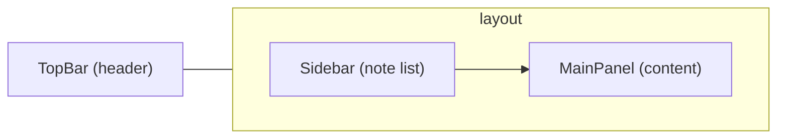
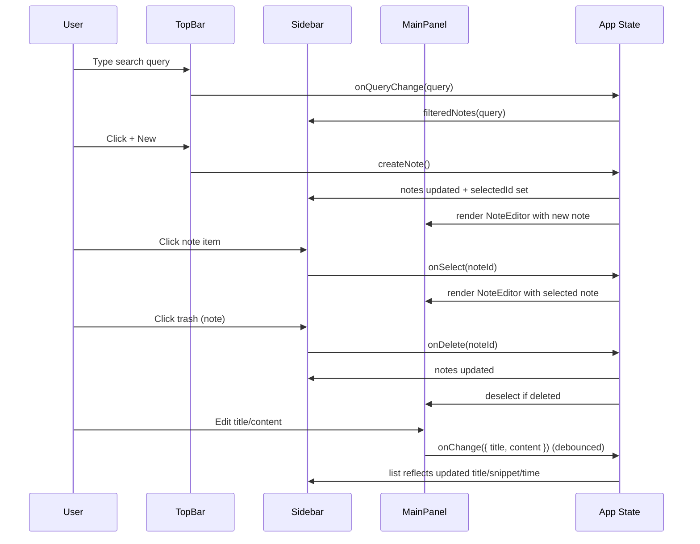

# Notes Frontend UI Documentation

## Introduction

### Background
This document describes the user interface of the notes_frontend React application. It is intended for developers, designers, and maintainers who need a clear understanding of the UI structure, styling choices, component responsibilities, and user interactions. The documentation is synchronized with the current codebase and reflects the implemented behavior and visual design defined in the source files.

### Scope
The scope covers the overall layout, navigation and workflows, component breakdown (top navigation bar, sidebar, main panel and editor), style and theme choices, interaction patterns, accessibility notes, and guidelines for extending or modifying the UI. The application is a modern, minimalistic, light-themed notes app that supports creating, editing, deleting, listing, and searching notes. Data persistence is currently local to the browser via localStorage.

## UI Overview

### Layout Summary
The UI employs a three-part structure:
- Top Navigation Bar (TopBar): A sticky header containing branding, a global search input, and a primary action to create a new note.
- Sidebar: A left column showing the list of notes with title, snippet, updated time, and an inline delete action.
- Main Panel: A right-side content area that displays either the note editor for the selected note or an empty state prompting note creation.

The layout uses a responsive grid that collapses to a single column on narrow viewports. At smaller widths, the sidebar becomes a top section with a fixed height and a bottom border.

### High-Level Structure Diagram

## Component Breakdown

### App
- Location: src/App.js
- Responsibility: Hosts application state and composes TopBar, Sidebar, and MainPanel. Manages notes, selection, and search query. Persists notes to localStorage under the key notes_app_items_v1.
- Key interactions:
  - createNote(): Creates a new note with id, default title "Untitled note", empty content, and current timestamp. Selects the new note.
  - deleteNote(id): Removes a note; if it is currently selected, clears the selection.
  - updateNote(id, patch): Updates a note in place and refreshes updatedAt.
  - selectNote(id): Sets the selected note by id.
  - filteredNotes: Derived list filtered by global query (matches title or content, case-insensitive) and sorted by most recently updated.

### TopBar
- Location: src/App.js (component: TopBar)
- Structure:
  - Branding area with a gradient brand mark and "Notes" title plus subtitle "Light & Minimal".
  - Search input for global filtering of notes.
  - "+ New" primary button to create a note.
  - A meta label showing "Total: N".
- UX notes:
  - The search input updates query state immediately on input change.
  - The primary action is emphasized visually using the primary color.

### Sidebar
- Location: src/App.js (component: Sidebar)
- Structure:
  - Header with "My Notes" title and a "+" ghost button to create a note.
  - Scrollable note list:
    - Each item shows title (trimmed, falls back to "Untitled"), a snippet (first 80 characters of content), updated time ("just now", "N mins ago", etc.), and a trash icon button.
    - Active item is highlighted with an outline and a subtle background.
  - Empty list message when no notes are available.
- UX notes:
  - Clicking a note item selects it.
  - Clicking the delete icon on a note removes it without triggering selection (click propagation is stopped).
  - Items show hover feedback and slight elevation via transform.

### MainPanel
- Location: src/App.js (component: MainPanel)
- Responsibility: Container for the note editor or the empty state.
- Behavior:
  - If a note is selected: renders NoteEditor.
  - Otherwise: renders EmptyState.

### NoteEditor
- Location: src/App.js (component: NoteEditor)
- Structure:
  - Title input: large, bold input for the note title.
  - Delete button: destructive action for the current note.
  - Content textarea: multiline area for note content with comfortable line-height.
  - Footer: shows "Last edited ..." relative time.
- Behavior:
  - Local component state mirrors the provided note and updates when note.id changes.
  - Debounced save: pushes title/content changes back up via onChange after 200ms, updating the parent state and timestamp.
- UX notes:
  - Inputs show clear focus states and comfortable spacing.
  - Deletion is a single action; there is no confirm dialog in the current implementation.

### EmptyState
- Location: src/App.js (component: EmptyState)
- Responsibility: Friendly placeholder encouraging the user to create the first note.
- Structure: Headline, short description, and a primary button that triggers note creation.

## Navigation and Workflows

### Primary Flows
- Create a note:
  1. Click "+ New" in the TopBar or "+" in the Sidebar header.
  2. A new "Untitled note" is created, selected, and opened in the editor.
  3. Edit the title and content; changes auto-save (debounced).
- Edit a note:
  1. Select a note in the Sidebar.
  2. Modify title or content in the Main Panel editor.
  3. Changes are persisted immediately to localStorage via App state updates.
- Delete a note:
  1. In the Sidebar list, click the trash icon for the note, or in the NoteEditor click "Delete".
  2. The note is removed from the list. If it was selected, the editor closes and the EmptyState is shown.
- Search notes:
  1. Type in the TopBar search input.
  2. The Sidebar list filters to notes where title or content includes the query (case-insensitive). Results are sorted by most recent update.

### Interaction Map

## Style and Theme

### Visual Design
- Theme: Light, modern, minimalistic. Clean typography with generous spacing and subtle elevation.
- Color Palette:
  - Primary: #1976d2
  - Secondary: #90caf9
  - Accent: #fbc02d
- Neutrals:
  - Backgrounds: #ffffff (base), #f6f8fb (soft), #ffffff (elevated)
  - Text: #1f2937 (base), #6b7280 (muted)
  - Borders: #e5e7eb
- Effects:
  - Shadows use a soft double-shadow for subtle depth.
  - Focus ring: 0 0 0 3px rgba(25, 118, 210, 0.2) to emphasize accessibility and clarity of focus.
- Radius:
  - Small radius (8px) for controls, medium (12px) for cards/items.

All tokens are defined in src/App.css under :root, ensuring consistent theming across inputs, buttons, cards, and panels.

### Components and States
- Buttons:
  - Base .btn with hover transform (-1px) and border-color accent on hover.
  - .btn.primary: primary background with white text; darker hover state.
  - .btn.ghost: transparent background.
  - .btn.danger: red border and text; "outline" variant used for delete actions in the editor.
- Inputs:
  - Use .input, .title-input, .content-input classes with consistent borders, radii, and focus ring.
- List Items:
  - .note-item uses grid, hover elevation, and an active state highlighting the selected note.

### Responsiveness
- At max-width: 900px:
  - The grid collapses to one column (sidebar stacked on top of main panel).
  - Sidebar adopts a fixed height (~40vh) and gains a bottom border.
  - Input min-width reduces for space conservation.

## Interaction Design and Accessibility

### Patterns
- Immediate feedback on hover for interactive elements.
- Debounced save to avoid excessive updates while typing.
- Active states and focus rings to guide attention and accessibility.

### Keyboard and ARIA
- TopBar uses role="banner"; search area uses role="search".
- All actionable controls include aria-labels where icon-only or ambiguous.
- Inputs are standard HTML form elements, enabling native keyboard navigation.
- Future improvements could include:
  - Keyboard shortcuts (e.g., Cmd/Ctrl+N to create).
  - Escape to clear search or blur inputs.
  - Confirm dialog for deletion to prevent accidental loss.
  - Screen-reader-only labels for additional context where needed.

## Data and State Considerations

- Notes are stored in localStorage under notes_app_items_v1 and serialized as JSON.
- App state includes:
  - notes: array of { id, title, content, updatedAt }
  - selectedId: string | null
  - query: string
- Derived data:
  - filteredNotes: filtered by query (title or content) and sorted by updatedAt descending.
  - selectedNote: note with id === selectedId.

These state derivations drive the Sidebar display and the MainPanel content.

## Guidelines for Extending/Modifying the UI

### Adding New Features
- Tagging or Categories:
  - Extend the Note type to include tags: string[].
  - Reflect tags in Sidebar (small chips) and add a tag editor in NoteEditor.
  - Update filtering logic to include tag matches.
- Pinning Notes:
  - Add isPinned: boolean to Note.
  - Update sort to place pinned notes above others, then sort by updatedAt.
  - Show a pin icon in Sidebar items; provide a toggle in NoteEditor.
- Theming:
  - Introduce CSS variables for dark mode (e.g., :root[data-theme="dark"]).
  - Toggle via a topbar switch and store preference in localStorage.
- Confirmations:
  - Add a modal or confirm popover for deletions. Keep the action accessible and keyboard focus-trapped.

### Componentization and Reuse
- Consider extracting components from App.js into separate files:
  - components/TopBar.jsx
  - components/Sidebar.jsx
  - components/MainPanel.jsx
  - components/NoteEditor.jsx
  - components/EmptyState.jsx
- Benefits:
  - Improved maintainability and testability.
  - Easier to scale features independently (e.g., Sidebar virtualization for large note sets).

### Styling Practices
- Keep design tokens centralized in :root and reference variables consistently.
- When adding new controls, reuse .btn and .input patterns to maintain visual coherence.
- Use className modifiers for variants (e.g., .btn.primary, .btn.danger) rather than inline styles.

### Performance
- Current debounced updates in NoteEditor reduce save churn. If future features add heavy computations:
  - Memoize derived lists and expensive renders.
  - Consider virtualization for the note list if it grows significantly.

### Accessibility and Internationalization
- Ensure new icon-only buttons include descriptive aria-labels.
- Prefer semantic HTML for structure and landmarks.
- Plan for longer localized strings in buttons and labels; avoid fixed widths that can truncate.

## Visual References and CSS Tokens

### Key CSS Variables
- --color-primary: #1976d2
- --color-secondary: #90caf9
- --color-accent: #fbc02d
- --bg: #ffffff
- --bg-soft: #f6f8fb
- --bg-elev: #ffffff
- --text: #1f2937
- --text-muted: #6b7280
- --border: #e5e7eb
- --shadow: 0 1px 2px rgba(16, 24, 40, 0.04), 0 1px 3px rgba(16, 24, 40, 0.08)
- --radius-s: 8px
- --radius-m: 12px
- --focus: 0 0 0 3px rgba(25, 118, 210, 0.2)

### Class Map to Components
- TopBar: .topbar, .brand, .brand-mark, .brand-text, .brand-title, .brand-subtitle, .topbar-actions, .input, .btn.primary
- Sidebar: .sidebar, .sidebar-header, .sidebar-title, .note-list, .note-item, .note-item.active, .note-title, .note-snippet, .note-time, .icon-button.danger
- MainPanel and Editor: .main-panel, .note-editor, .editor-header, .title-input, .content-input, .editor-actions, .editor-footer
- States and Helpers: .muted, .empty-state

## Architecture and File Layout

### Files Referenced
- src/App.js: Contains all major UI components and state management.
- src/App.css: Defines the design tokens, core layout, and component-level styles.
- src/index.js: Entry point mounting the App component.

### Suggested Future Structure (Optional)
- src/components/
  - TopBar.jsx / .css
  - Sidebar.jsx / .css
  - MainPanel.jsx / .css
  - NoteEditor.jsx / .css
  - EmptyState.jsx / .css
- src/styles/
  - tokens.css
  - components.css

## Conclusion

### Summary
The notes_frontend UI is a clean, light-themed React application with a clear three-part layout. The TopBar enables quick creation and search, the Sidebar presents a concise and interactive list of notes, and the Main Panel provides an efficient editing experience. Design tokens enforce consistency across the UI, and interaction design favors responsiveness and simplicity. The guidelines herein should help maintainers extend the UI in a consistent and accessible manner.

### Sources
This documentation was produced by analyzing the current codebase, particularly:
- notes_frontend/src/App.js
- notes_frontend/src/App.css
- notes_frontend/src/index.js
- notes_frontend/package.json
